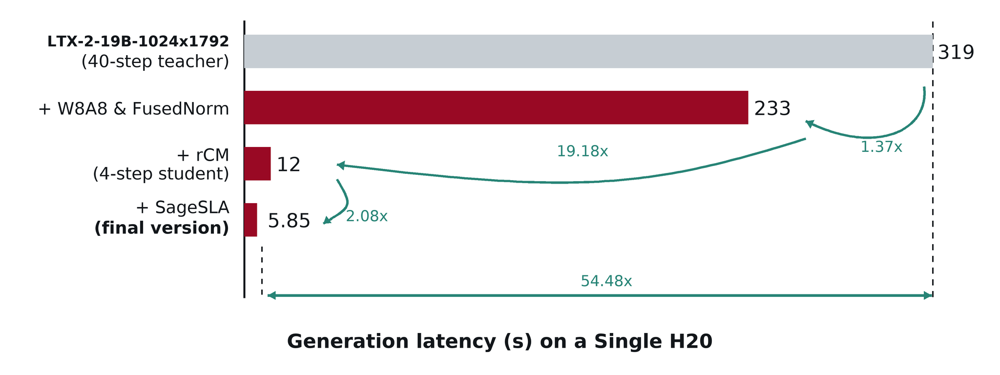

<div align="center">

# TurboT2AV

Fast text-to-audio-video generation distilled from LTX-2 19B.

</div>

## TurboDiffusion-Style Acceleration



Measured on a single NVIDIA H20 at `1024x1792`:

| Stage | Latency | Speedup vs previous | Speedup vs teacher | What changes |
| --- | ---: | ---: | ---: | --- |
| LTX-2-19B teacher (40 steps) | 318.7405s | - | 1.00x | Full teacher baseline with dense attention. |
| + W8A8 & FastNorm | 233.3424s | 1.37x | 1.37x | Add TileLang W8A8 Linear and FastNorm to the teacher. |
| + rCM (4-step student) | 12.1655s | 19.18x | 26.20x | Switch to the distilled student while retaining W8A8/FastNorm. |
| + SageSLA final | 5.8505s | 2.08x | 54.48x | Add SageSLA `topk=0.3` self-attention and text-context trimming. |

At this resolution the video latent is `[1,16,128,32,56]`, corresponding to
28,672 video self-attention tokens. The stages are cumulative: rCM keeps the
W8A8/FastNorm stack, and the final stage adds SageSLA and text-context
trimming. For reference, the pure 4-step student without these inference
optimizations takes 16.5245s/video, so the final path is also 2.82x faster than
the pure student.

See [TurboDiffusion Integration Notes](docs/acceleration.md) for the reused
components, LTX-2-specific adaptations, and interpretation of these results.

## Overview

TurboT2AV generates synchronized audio-video from text prompts in 4 steps.
The demo compares the 40-step teacher with the 4-step student.
This repository provides single-GPU inference for the distilled checkpoint.
On an NVIDIA H20 at 1024x1792, generator-only latency falls from 318.74
seconds/video for the 40-step teacher to 5.85 seconds/video for the accelerated
4-step student.

Main contributions:

- Combines the diversity of consistency models (DCM/SCM) with the high
  perceptual quality of score-model distillation (DMD), taking advantage of both
  families of methods by using CM as a forward-divergence offline method that
  complements DMD as a reverse-KL on-policy method.
- First extends this combined distillation strategy to a large-scale joint
  audio-video generation model at the 14B-video + 5B-audio scale.
- Integrates a TurboDiffusion-style inference stack with SageSLA, FastNorm, and
  TileLang W8A8 Linear. On a single NVIDIA H20 at 1024x1792, the final
  accelerated student is 54.48x faster than the 40-step teacher and 2.82x
  faster than the pure 4-step student.

## 1. Setup

```bash
cd TurboDiffusion/TurboT2AV/LTX-2
pixi install
pixi run install-acceleration
```

This single task installs the local LTX packages, CUDA 12.8 PyTorch,
SageAttention, SpargeAttn, and TileLang. It provides everything required by the
recommended SageSLA + FastNorm + TileLang W8A8 inference path.

### Development Tests (Optional)

Run the unit tests in the development environment with:

```bash
pixi run -e dev test
```

The `test` task installs CUDA 12.8 PyTorch and the local LTX packages in the
development environment before running the test suite. Inference-only users do
not need this step.

## 2. Download Weights

| Model Name | Checkpoint Link |
| --- | --- |
| TurboT2AV-14BVideo-5BAudio | [Hugging Face Model](https://huggingface.co/luyu1021/TurboT2AV) |
| LTX-2-19B | [Hugging Face Model](https://huggingface.co/Lightricks/LTX-2) |
| Gemma-3-12B-IT-QAT-Q4_0 | [Hugging Face Model](https://huggingface.co/google/gemma-3-12b-it-qat-q4_0-unquantized) |

Gemma is a gated Hugging Face model. Before downloading, visit the model page,
accept the access terms, and export a Hugging Face token with access permission:

```bash
export HF_TOKEN=your_huggingface_token
```

Base model weights:

```bash
pixi run hf download Lightricks/LTX-2 ltx-2-19b-dev.safetensors --local-dir /path/to/checkpoints/LTX-2
pixi run hf download google/gemma-3-12b-it-qat-q4_0-unquantized --local-dir /path/to/checkpoints/gemma-3-12b-it-qat-q4_0-unquantized
```

TurboT2AV main checkpoint:

```bash
pixi run hf download luyu1021/TurboT2AV \
  --include "checkpoints/turbot2av_main/*" \
  --local-dir /path/to/turbo-t2av-weights
```

## 3. Run Inference

Run the following commands from `TurboDiffusion/TurboT2AV/LTX-2`:

```bash
export TURBO_CHECKPOINT_PATH=/path/to/ltx-2-19b-dev.safetensors
export TURBO_GEMMA_PATH=/path/to/gemma-3-12b-it-qat-q4_0-unquantized
export PYTHONPATH=../..:../../turbodiffusion:$PYTHONPATH
```

`--prompts_file` accepts a text file with one prompt per line or a CSV file with
a `prompt` column.

### Accelerated Student (Recommended)

```bash
CUDA_VISIBLE_DEVICES=0 pixi run python -m ltx_distillation.tools.run_av_inference_eval \
  --config_path packages/ltx-distillation/configs/bidirectional_rcm.yaml \
  --prompts_file /path/to/prompts.csv \
  --output_dir /path/to/student_output \
  --model_kind student \
  --student_checkpoint /path/to/turbo-t2av-weights/checkpoints/turbot2av_main/model.pth \
  --student_param auto \
  --num_prompts 8 \
  --video_height 1024 \
  --video_width 1792 \
  --attention_type sagesla \
  --attention_scope self \
  --sla_topk 0.3 \
  --trim_text_context \
  --fast_norm \
  --quant_linear \
  --quant_linear_scope all \
  --quant_linear_backend tilelang_postscale
```

### Teacher Baseline (40 Steps)

```bash
CUDA_VISIBLE_DEVICES=0 pixi run python -m ltx_distillation.tools.run_av_inference_eval \
  --config_path packages/ltx-distillation/configs/bidirectional_rcm.yaml \
  --prompts_file /path/to/prompts.csv \
  --output_dir /path/to/teacher_output \
  --model_kind teacher \
  --teacher_mode native_rf \
  --teacher_steps 40 \
  --num_prompts 8 \
  --video_height 1024 \
  --video_width 1792
```

## Demos

<table>
  <thead>
    <tr>
      <th align="center" width="50%">Teacher (40 steps)</th>
      <th align="center" width="50%">Student (4 steps)</th>
    </tr>
  </thead>
  <tbody>
    <tr>
      <td align="center" width="50%"><video src="https://github.com/user-attachments/assets/b77f784f-bf88-42cd-abcd-fbcd7632f87e" alt="1" width="100%" controls></video></td>
      <td align="center" width="50%"><video src="https://github.com/user-attachments/assets/b25f22f0-1dcd-455a-b58b-76fa8b4dd953" alt="1" width="100%" controls></video></td>
    </tr>
    <tr>
      <td align="center" width="50%"><video src="https://github.com/user-attachments/assets/aab16cb9-903e-49b9-a14a-d4a126cec90f" alt="2" width="100%" controls></video></td>
      <td align="center" width="50%"><video src="https://github.com/user-attachments/assets/94596e26-3d88-45af-8457-3d5567027544" alt="2" width="100%" controls></video></td>
    </tr>
    <tr>
      <td align="center" width="50%"><video src="https://github.com/user-attachments/assets/a602f6bc-3d50-4684-9a4f-11923bbfd171" alt="3" width="100%" controls></video></td>
      <td align="center" width="50%"><video src="https://github.com/user-attachments/assets/6454308f-605c-4931-8d5d-13e3a08a86d5" alt="3" width="100%" controls></video></td>
    </tr>
    <tr>
      <td align="center" width="50%"><video src="https://github.com/user-attachments/assets/0505830b-b284-4574-b68b-143fa092d848" alt="4" width="100%" controls></video></td>
      <td align="center" width="50%"><video src="https://github.com/user-attachments/assets/7d5d78d9-bc28-48e4-bdc3-8d7747102fc5" alt="4" width="100%" controls></video></td>
    </tr>
    <tr>
      <td align="center" width="50%"><video src="https://github.com/user-attachments/assets/5cdfbb6d-bc16-4616-9c22-2a8b34fb2bae" alt="5" width="100%" controls></video></td>
      <td align="center" width="50%"><video src="https://github.com/user-attachments/assets/5b20660f-4a1e-4697-8dc3-ca9bcc4ce4b1" alt="5" width="100%" controls></video></td>
    </tr>
    <tr>
      <td align="center" width="50%"><video src="https://github.com/user-attachments/assets/5d683a90-eda0-4d70-b7bb-aaaa6d57b69a" alt="6" width="100%" controls></video></td>
      <td align="center" width="50%"><video src="https://github.com/user-attachments/assets/bdf64623-11f1-4c8c-b62e-effff2471d09" alt="6" width="100%" controls></video></td>
    </tr>
    <tr>
      <td align="center" width="50%"><video src="https://github.com/user-attachments/assets/a1c86480-60c3-425f-8d9c-2242a67bfd14" alt="7" width="100%" controls></video></td>
      <td align="center" width="50%"><video src="https://github.com/user-attachments/assets/69d8b8f3-b0c1-4526-aa8a-6cd15932cf5a" alt="7" width="100%" controls></video></td>
    </tr>
  </tbody>
</table>
